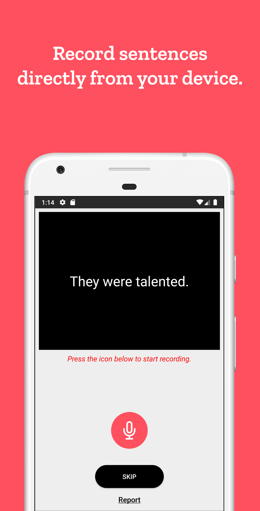
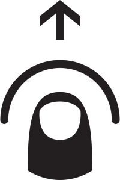

#  </img> Common Voice Android

[**Official web page of this project**](https://www.saveriomorelli.com/commonvoice/): you can find F.A.Q. and some useful links.

This is not the official app of the Common Voice project by Mozilla. This app is developed by Saverio Morelli, using the Android Studio IDE.

    

[</img>](https://bit.ly/2Y9iqnK) [</img>](https://bit.ly/3cO8iEQ)  [</img>](https://bit.ly/3bNBoUU)

If you have any questions, please open an issue (you can add the label `question` there).

[**You can see Anonymous Statistics**](https://bit.ly/35d2dza)

You can contact me also on Telegram, with the username `@Sav22999` (I speak `Italian` and `English`); I’m always available to support you or to respond to your questions.

If you like this project, leave a *Star* to receive updates on your *GitHub dashboard*.

To support me, you can do a donation :smile: with PayPal:

[</img>](https://bit.ly/3aJnnq7)

### How contribute

If you want to help to develop this app, you can open an `Issue` an send feedback about the features or report bugs.

You can contribute also to translate the app (follow every step, please):

1. **Open a new issue** (use `Translation` template), so others know you are translating the app in that language
1. Then go to [Crowdin](https://bit.ly/3bNBoUU), choose your language (you can ask for a new language if it’s not in the list) and translate strings.

_If your language is not now supported by [Common Voice](https://voice.mozilla.org/it), **don't worry!** You can translate the app anyway, when it will be supported, the app will be already translated in your language!_

### In development...

These features/options aren't available now, but probably the will be available in a future release of the app.

- [priority] Sending validations/recordings in background: so you won't wait anymore that the sending is finished
- Offline mode (or "Airplane mode"): you will be able to validate clips and record sentences offline, and in a second moment they will be send to the server
- Customisable gestures: you will be able to customise gestures
- New themes: at least "Light", "Dark" and "Auto mode" (but maybe you will be able to create your theme)
- Settings reorganised
- Save logs to file
- Some animations in Listen and Speak
- Gestures guide
- "Top contributors" in Dashboard

### Screenshots

</img></img></img></img></img></img>

If you want screenshots of the other versions, go to the `screenshots` folder.

### Why an Android app of Common Voice?

There is already the website, which is responsive and mobile-friendly, but actually it’s very slow because of so many animations and graphic effects, which distract and annoy you. So, this app want to improve the experience of this fantastic project. You can see statistics, voices online; you can set the daily goal (it's not the same of Common Voice website); you can record sentences and validate clips, with a few taps. So, the app is smart, customisable, light, but powerful.

### Gestures

You can turn on "Gestures" in Settings. These are the supported gestures (now):

|                         **Swipe-up**                         |                        **Swipe-left**                        |                       **Swipe-right**                        |
| :--: | :--: | :--: |
| </img> | </img> | </img> |
| In **Speak** and **Listen** you can swipe-up to *Report* a clip/sentence |In **Speak**, **Listen**, **Login**, **Profile**, **All badges** you can swipe-left to go back (so, it's the some action of "back button")| In **Speak** and **Listen** you can swipe-right to *Skip* the clip/sentence |
| In **Tutorial** you can swipe-up to see *Terms* (just the first view of tutorial) | In **Tutorial**, **First-run Listen** and **First-run Speak** you can swipe-left to go back to the previous view ("to navigate") | In **Tutorial**, **First-run Listen** and **First-run Speak** you can swipe-right to go forward to the next view ("to navigate") |

### Translations

The app is officially translated in these following languages, **thank you very much** to the contributors who translated the app.

Legend:

|                 ✅                  |          🔶          |                       🔴                        |
| :--------------------------------: | :-----------------: | :--------------------------------------------: |
| Full translation (95%+ translated) | Partial translation | Not yet available for the Common Voice project |

-----------

| Status | Percentage | Language (code) | Language (name) | Translators                                                  |                             Link                             |
| :----: | :--------: | :-------------: | :-------------- | :----------------------------------------------------------- | :----------------------------------------------------------: |
|   ✅    |    98%     |      `ar`       | Arabic          | [**ABDELGHANI HOURANI**](https://crowdin.com/profile/abdelghani.me) | **[Translate](https://crowdin.com/project/common-voice-android/ar)** |
|   🔶    |    12%     |      `ca`       | Catalan         | [**Carles Paredes Lanau**](https://crowdin.com/profile/carlesparedes) | **[Translate](https://crowdin.com/project/common-voice-android/ca)** |
|   🔶    |    24%     |      `cs`       | Czech           | [**acrylicpaintboy**](https://crowdin.com/profile/acrylicpaintboy) | **[Translate](https://crowdin.com/project/common-voice-android/cs)** |
|   🔶    |    43%     |      `de`       | German          | [**acrylicpaintboy**](https://crowdin.com/profile/acrylicpaintboy), [**Moini**](https://github.com/Moini), [**akoyaxd**](https://crowdin.com/profile/akoyaxd) | **[Translate](https://crowdin.com/project/common-voice-android/de)** |
|   ✅    |  *(main)*  |      `en`       | English         | [**Saverio Morelli**](https://github.com/Sav22999), [**Cadence Ember**](https://github.com/cloudrac3r) |                         _(nothing)_                          |
|   🔶    |     1%     |      `eo`       | Esperanto       | [**tuxayo**](https://github.com/tuxayo)                      | **[Translate](https://crowdin.com/project/common-voice-android/eo)** |
|   🔶    |    25%     |      `es`       | Spanish         | [**acrylicpaintboy**](https://crowdin.com/profile/acrylicpaintboy) | **[Translate](https://crowdin.com/project/common-voice-android/es-ES)** |
|   🔶    |    14%     |      `et`       | Estonian        | [**Agu Ratas**](https://crowdin.com/profile/aguratas)        | **[Translate](https://crowdin.com/project/common-voice-android/et)** |
|   ✅    |    100%    |      `eu`       | Basque          | **[Mielanjel Iraeta](https://crowdin.com/profile/pospolos)** | **[Translate](https://crowdin.com/project/common-voice-android/eu)** |
|   🔶    |    74%     |      `fa`       | Persian         | [**Danial Behzadi**](https://crowdin.com/profile/danialbehzadi) | **[Translate](https://crowdin.com/project/common-voice-android/fa)** |
|   ✅    |    100%    |      `fr`       | French          | **[PoorPockets McNewHold](https://crowdin.com/profile/IfiwFR)**, [**acrylicpaintboy**](https://crowdin.com/profile/acrylicpaintboy), [**Lexane**](https://github.com/exilexi), [**grrgui**](https://crowdin.com/profile/pascaloulou) | **[Translate](https://crowdin.com/project/common-voice-android/fr)** |
|   ✅    |    100%    |      `ia`       | Interlingua     | **[Carmelo Serraino](https://crowdin.com/profile/Melo46)**   | **[Translate](https://crowdin.com/project/common-voice-android/ia)** |
|   ✅    |    100%    |      `it`       | Italian         | [**Saverio Morelli**](https://github.com/Sav22999)           | **[Translate](https://crowdin.com/project/common-voice-android/it#)** |
|   🔶    |    20%     |      `nl`       | Dutch           | [**Pander**](https://github.com/PanderMusubi)                | **[Translate](https://crowdin.com/project/common-voice-android/nl)** |
|   🔶    |    25%     |      `ru`       | Russian         | **[Anton Nesterov](https://github.com/komachi)**, [**Roman Prokopov**](https://crowdin.com/profile/Roman100) | **[Translate](https://crowdin.com/project/common-voice-android/ru)** |
|   ✅🔴   |    100%    |      `sk`       | Slovak          | [**tadeasbucha**](https://github.com/tadeasbucha), [**xrup**](https://crowdin.com/profile/xrup) | **[Translate](https://crowdin.com/project/common-voice-android/sk)** |
|   🔶    |    25%     |     `sv-SE`     | Swedish         | **[Linus Amvall](https://github.com/klasrocket)**, [**acrylicpaintboy**](https://crowdin.com/profile/acrylicpaintboy) | **[Translate](https://crowdin.com/project/common-voice-android/sv-SE)** |
|   ✅    |    100%    |      `ta`       | Tamil           | [**Manimaran.K**](https://crowdin.com/profile/manimaran96)   | **[Translate](https://crowdin.com/project/common-voice-android/ta)** |
|   🔶    |    11%     |      `tr`       | Turkish         | [**Ege Özdemir**](https://crowdin.com/profile/ValentinMoon)  | **[Translate](https://crowdin.com/project/common-voice-android/tr)** |

### License

The license of *Common Voice Android* is GPLv3.

</img>

   

[</img>](https://saveriomorelli.com/projects)  [</img>](https://saveriomorelli.com)