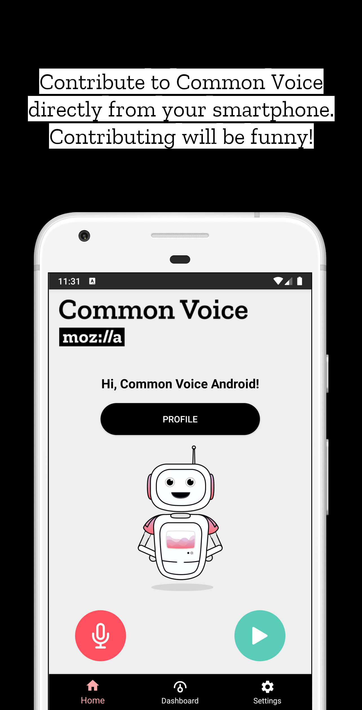
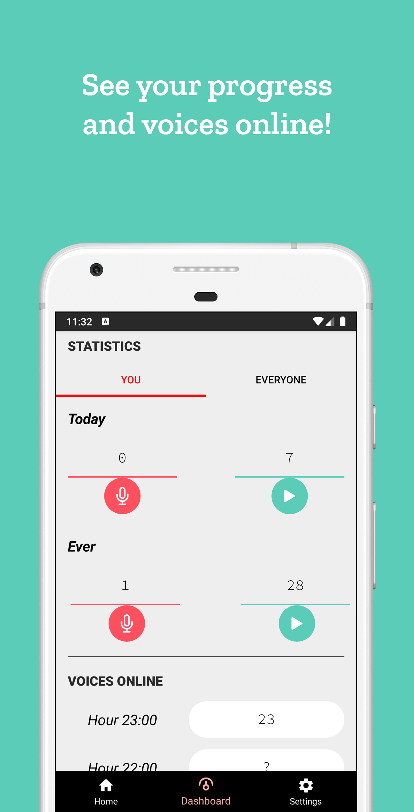
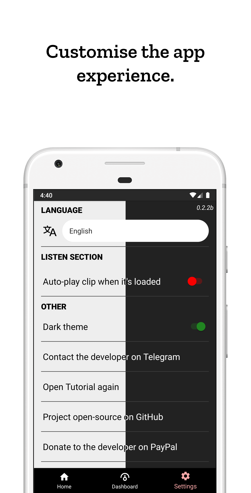
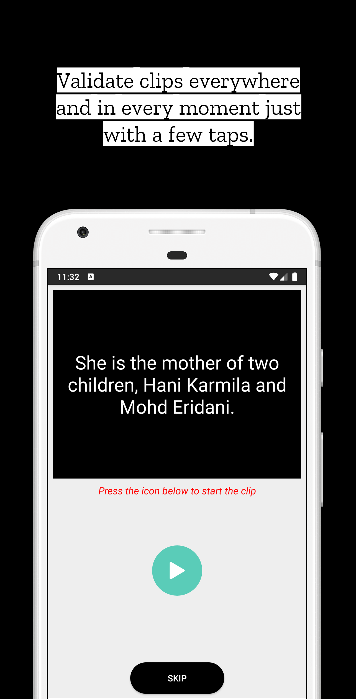

#  </img> Common Voice 

This is not the official app of the Common Voice project by Mozilla. This app is developed by Saverio Morelli, using the Android Studio IDE.

     

[</img>](https://play.google.com/store/apps/details?id=org.commonvoice.saverio) [</img>](https://f-droid.org/it/packages/org.commonvoice.saverio) [</img>](https://common-voice-android.en.aptoide.com/?store_name=sav22999) [</img>](https://crowdin.com/project/common-voice-android)

If you have any questions, please open an issue (you can add the label `question` there).

You can contact me also on Telegram, with the username `@Sav22999` (I speak `Italian` and `English`); I’m always available to support you or to respond to your questions.

### How contribute

If you want to help to develop this app, you can open an `Issue` an send feedback about the features or report bugs.

You can contribute also to translate the app (follow every step, please):

1. **Open a new issue** (use `Translation` template), so others know you are translating the app in that language
1. Then go to [Crowdin](https://crowdin.com/project/common-voice-android), choose your language (you can ask for a new language if it’s not in the list) and translate strings.

#### To do:

- **PRIORITY**: Create `POST` request to send the recording (Now it saves the audio on device, but I don’t know how to send the audio file to CV server) -> to do tests use voice.allizom.org instead of the main server -> You should send as `opus codecs` (probably)

### Screenshots

</img></img></img></img></img> 

If you want screenshots of the other versions, go to the `screenshots` folder.

### Why an Android app of Common Voice?

There is already the website, which is responsive and mobile-friendly, but actually it’s very slow because of so many animations and graphic effects, which distract and annoy you. So, this app want to improve the experience of this fantastic project. You can see statistics, voices online. You can record sentences or validate clips, with a few taps. So, the app is smart, customisable, light, but powerful.

### Translators

The app is officially translated in these following languages, **thank you very much** to the contributors who translated the app.

- `en` English (main language)
- `et` Estonian -> [**Agu Ratas**](https://crowdin.com/profile/aguratas)
- `eu` Basque -> **[Mielanjel Iraeta](https://crowdin.com/profile/pospolos)**
- `ia` Interlingua -> **[Carmelo Serraino](https://crowdin.com/profile/Melo46)**
- `it` Italian -> **[Saverio Morelli](https://github.com/Sav22999)**
- `sv-SE` Swedish -> **[Linus Amvall](https://github.com/klasrocket)**
- `fr` French -> **[PoorPockets McNewHold](https://crowdin.com/profile/IfiwFR)**

### License

The license of *Common Voice Android* is GPLv3.

</img>

 

 